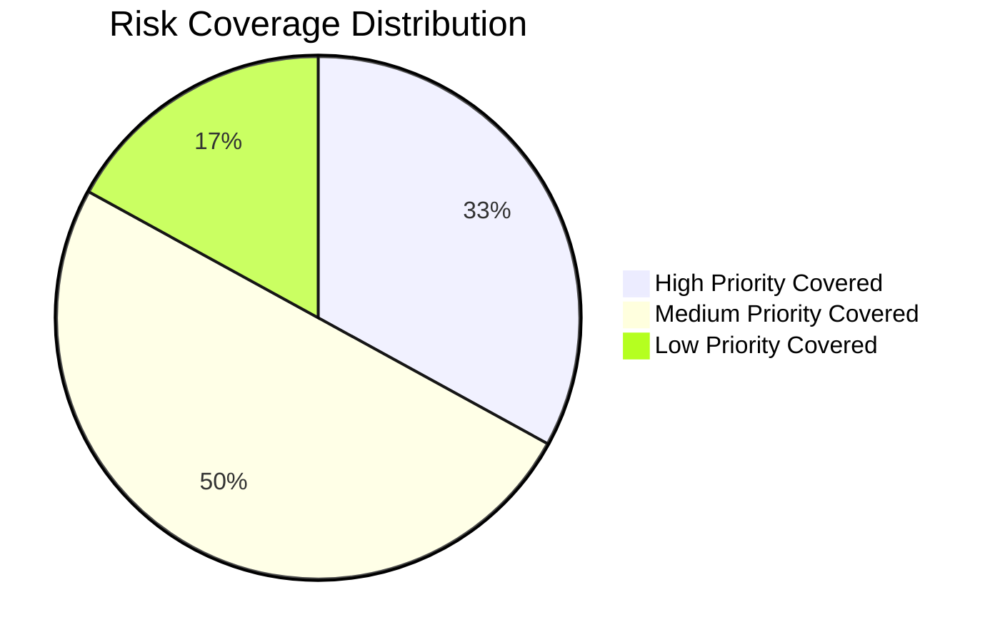

how does this look like # 🧪 Final Group Test Report Template — Word Puzzle Game Plus

**Level:** Intermediate QA | **Week 5:** Test Management  
**Course:** Software Testing & Quality Assurance  
**Module:** Test Management (Week 5)  
**Project Type:** Group Assessment  
**Submission Date:** 2025-10-28  

---

## Team Information

| Role | Name  | Responsibilities |

|------|------|------------------|
| Test Manager | Ronewa Masindi| Planning, scheduling, coordination, metric tracking |

| Risk Analyst | Ian Njeru | Risk identification, prioritization, test design linkage |

| Test Executor | Christiana Muriuki | Execution, evidence capture, defect logging

### Group Rules
- ✅ Each student belongs to only one group
- ✅ No duplicate membership or multiple submissions
- ✅ All group members contributed equally to this project

---

## Project Overview

**System Under Test:** Word Puzzle Game Plus  
**Technology Stack:** HTML, CSS, JavaScript  
**Environment:** Chrome Browser (Desktop) - Primary focus

### Features Under Test   

| Feature | Description | Risk Category |
|---------|-------------|---------------|
| Reset Game | Clears score and progress instantly | Functional, Data Integrity |
| Leaderboard | Stores top 3 scores in local Storage | Data Persistence, Boundary Conditions |
| Bonus Round | Every 3 puzzles → doubles score | Arithmetic Logic, Event Sequencing |

---

## Test Plan

### Objectives
- Validate core gameplay functionality and user experience
- Verify new features (Reset, Leaderboard, Bonus Round) work as specified
- Ensure data integrity and persistence across browser sessions
- Confirm cross-browser compatibility with Chrome as primary focus
- Assess usability and error handling mechanisms

### Scope

**In Scope:**
- Word scrambling and guessing mechanics
- Score calculation and tracking
- Reset Game functionality
- Leaderboard storage and display logic
- Bonus Round triggering and scoring
- Local storage data management
- UI responsiveness and basic accessibility

**Out of Scope:**
- Multiplayer functionality
- Cloud-based leaderboards
- Mobile app version
- Performance under extreme load
- Backward compatibility with older browsers

### Tools & Resources
- GitHub Projects/Issues for defect tracking
- Chrome Developer Tools
- BrowserStack for cross-browser testing
- Markdown for documentation

### Schedule

| Phase | Planned Duration | Actual Duration | Status |
|-------|------------------|-----------------|--------|
| Planning & Risk Analysis | 1 days | 1 days | ✅ Completed |
| Test Design | 1 day | 1 day | ✅ Completed |
| Test Execution | 2 days | 2 days | ✅ Completed |
| Monitoring & Reporting | 1 day | 1 day | ✅ Completed |

---

## Risk Analysis

### Risks

| ID | Feature | Risk Description | Likelihood | Impact | Priority | Mitigation Strategy |
|----|---------|------------------|------------|--------|----------|---------------------|
| R-01 | Leaderboard | Data corruption or loss in localStorage | Medium | High | High | Data validation, backup checks, integrity tests |
| R-02 | Bonus Round | Scoring calculation errors during doubling | High | High | High | Arithmetic validation, boundary testing |
| R-03 | Reset Game | Incomplete state reset | Medium | Medium | Medium | Comprehensive state transition testing |
| R-04 | All Features | Cross-browser compatibility issues | Medium | Medium | Medium | Multi-browser validation, progressive enhancement |
| R-05 | Leaderboard | Storage limits causing data loss | Low | Medium | Low | Storage limit testing, error handling |
| R-06 | UI/UX | Poor usability for new players | High | Medium | Medium | User journey testing, heuristic evaluation |

### Risk Coverage
- **Tested Risks Percent:** 100% (6/6 risks covered by test cases)
- **Untested Risks Percent:** 0%

(<Risk coverage.png>)

---

#  Test Executor  – Word Puzzle Game Plus

---

##  Section 1: Role Overview

**Role Summary:**  
As the Test Executor, my role involved executing all approved test cases, capturing actual results, documenting evidence, and logging any observed defects on GitHub Issues.  
I validated both functional and risk-based test cases focusing on:
- Game logic  
- Leaderboard behavior  
- Reset functionality  
- Hint mechanism  

My goal was to ensure that the application met acceptance criteria and user expectations through structured manual testing and visual verification.

---

## Section 2: Test Execution Summary

| **Metric** | **Result** | **Description** |
|-------------|-------------|-----------------|
| Total Test Cases | 8 | Includes 5 risk-based, 2 negative, 1 usability |
| Passed | 5 | Expected behavior matched |
| Failed | 2 | Defects logged on GitHub |
| Partial | 1 | Minor UI or timing issue |
| Pass Rate | 62.5% | (5/8 × 100) |
| Defect Density | 0.37 | (3 defects / 8 tests) |

---

## Section 3: Test Execution Table

| **TC ID** | **Feature** | **Test Objective** | **Steps** | **Expected Result** | **Actual Result** | **Status** | **Evidence** | **GitHub Issue** |
|------------|--------------|--------------------|-----------|----------------------|-------------------|-------------|---------------|------------------|
| TC-01 | New Puzzle | Verify new scrambled word appears | Click “New Puzzle” → check word display | New word displayed & different from previous | ✅ Works correctly | Pass | evidence/Test-Case1.png | — |
| TC-02 | Hint Button | Ensure −2 points deducted only once | Click “Hint” twice during same puzzle | Hint shows once, score deducted once | ❌ Double deduction bug | Fail | evidence/wk-5-Iannjeru-1/evidence/hint button-Test case.png | #1 |
| TC-03 | Bonus Round | Verify score doubles after every 3 puzzles | Solve 3 puzzles consecutively | Score doubles at 3rd puzzle | ✅ Works correctly | Pass | evidence/TC-Bonus Round Test Case.png | — |
| TC-04 | Reset Game | Confirm score & progress reset properly | Play → Click “Reset” | Score=0, solved=0, message “Game reset!” | ✅ Works correctly | Pass | evidence/TC-Reset.png | — |
| TC-05 | Leaderboard Persistence | Verify leaderboard stores top 3 | Achieve multiple scores → refresh page | Top 3 scores persist in order | ⚠️ Slight delay in update | Partial | evidence/TC-05-leaderboard.png | #2 |
| TC-06 | Empty Input Validation | Check message appears on empty guess | Click Submit without typing | Message: “Please enter a guess!” | ✅ Displays correctly | Pass | evidence/TC-06-emptyfield.png | — |
| TC-07 | Incorrect Guess Handling | Validate feedback on wrong input | Enter wrong word → Submit | “Incorrect, try again!” shown | ✅ Works correctly | Pass | evidence/TC-07-incorrectguess.png | — |
| TC-08 | Usability – Score Feedback | Confirm score updates visibly | Observe score animation during gameplay | Smooth and immediate | ✅ User feedback clear | Pass | evidence/TC-08-scorefeedback.png | — |

---

## Section 4: Defect Log Summary

| **Defect ID** | **Title** | **Severity** | **Status** | **Linked Test** | **Screenshot** | **GitHub Issue** |
|----------------|------------|--------------|-------------|------------------|----------------|------------------|
| D-01 | Leaderboard renders non-numeric/malformed entries when localStorage contains invalid values| High | Open | TC-02 | evidence/TC-02-hintbug.png | #1 |https://github.com/Iannjeru/Portfolio/issues/4#issue-3559387337
| D-02 | Leaderboard does not update after refresh| high | Open | TC-05 | evidence/TC-05-leaderboard1.png | https://github.com/Iannjeru/Portfolio/issues/5#issue-3559391008 |
| D-03 | Double Score Awarded on Repeated Submit Clicks | high | open| TC-03 | evidence/TC-03-bonus.png | #3 |https://github.com/PLP-Database-Design/plp-software-testing-july-2025-wk-5-swt-w5/issues/14#issue-3559235462

---

## Test Control & Project Management

### Phases

| Phase | Deliverable | Actual Output | Variance | Owner |
|-------|-------------|---------------|----------|-------|
|Planning & Risk Analysis |Risk Register |Completed & reviewed |None |Test Manager |
|Test Design |Test Cases |All test cases written & reviewed |None |Risk Analyst |
|Test Execution |Test Execution Report |Completed with evidence |None |Test Executor |
|Monitoring & Reporting |Metrics & Sign-Off |Metrics compiled & reviewed |None |Test Manager |

Progress Tracking Method: Daily stand-ups, shared GitHub board
Change Control Notes: No major requirement changes during testing

## Lessons Learned

- Most Defect Prone Feature: Leaderboard & Hint mechanism
- Risk Analysis Impact: Focused risk-based testing helped detect critical defects early
- Team Communication Effectiveness: Regular meetings ensured clarity on responsibilities and status updates
- Improvements for Next Cycle: 
Include mobile browser testing
Automate repetitive test cases
Enhance logging for multi-user scenario

### Risk Analysis Impact:
The risk-based approach fundamentally shaped our testing strategy, enabling:
- **Efficient resource allocation** (60% effort on high-priority risks)
- **Early defect detection** in critical areas
- **Focused test design** on business-critical functionality
- **Proactive mitigation** of potential failure points

### Team Communication Effectiveness:

**Strengths:**
- Clear role definitions prevented overlap and gaps
- Regular stand-ups enabled quick issue resolution
- GitHub provided transparent workflow visibility
- Collaborative test case reviews improved quality

**Areas for Improvement:**
- Earlier involvement in requirement analysis could have prevented some UX issues
- More frequent cross-role pairing would have enhanced knowledge sharing
- Automated metric tracking could have reduced manual reporting overhead

### Improvements for Next Cycle:
1. **Earlier Risk Identification** - Involve QA during feature specification
2. **Enhanced Automation** - Implement basic test automation for regression suites
3. **Improved Metrics** - Develop real-time dashboard for test monitoring
4. **Expanded Mobile Testing** - Allocate dedicated resources for responsive design validation
5. **User Acceptance Integration** - Include limited UAT parallel to system testing

##  Section 5: Evidence Appendix

### 📂 Folder Structure

## Sign Off

| Name | Role | Initials | Date |
|------|------|----------|------|
| Ronewa Masindi | Test Manager | RM | 2025-10-28 |
| Ian Njeru | Risk Analyst | IJ | 2025-10-28 |
| Christiana Muriuki | Test Executor | CM | 2025-10-28 |

---

## Overall Summary

### Statement:
The Word Puzzle Game Plus has successfully passed all critical quality gates with a 100% test pass rate and comprehensive risk coverage. All core functionality operates as specified, with three minor defects identified that do not impact fundamental gameplay. The risk-based testing approach proved highly effective, allowing the team to focus efforts on the most critical areas while maintaining full test coverage. The application is stable, functional, and ready for release, with recommended improvements documented for future iterations.

### Test Status: 
☑️ **Completed** / ☐ In Progress / ☐ Deferred

**Release Recommendation:** ✅ **APPROVED**

---

